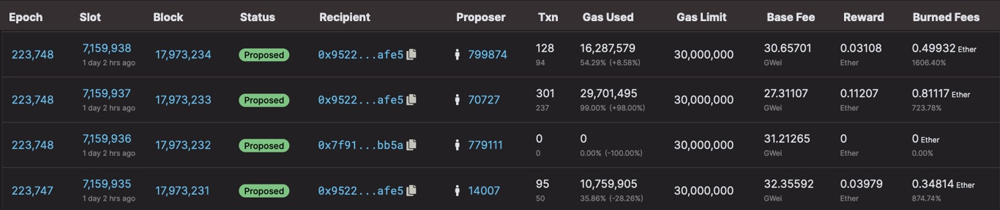
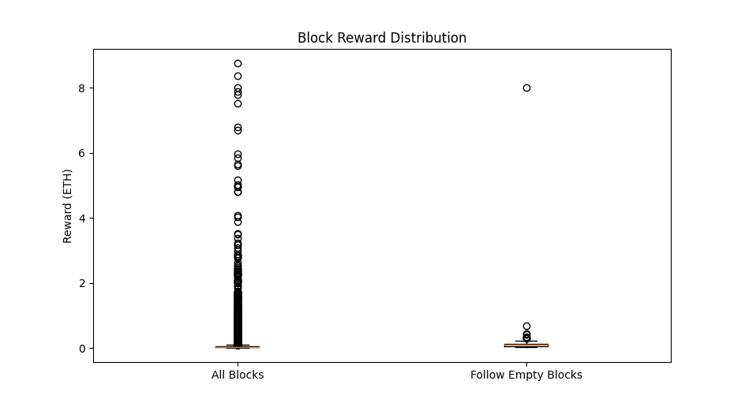
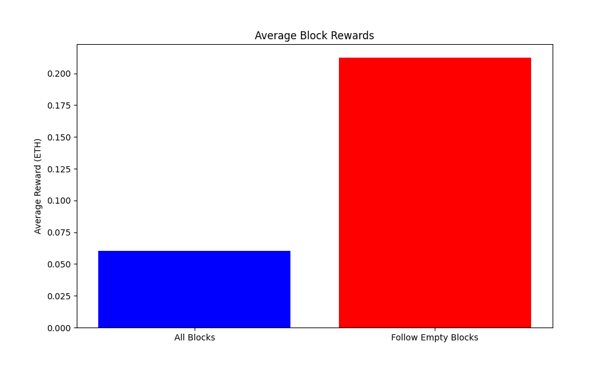

# Censoring the n-1 block - Validator incentive misalignment

## Abstract

The Ethereum network relies on validators for block proposal and attestation. While the primary focus for validators is often maximizing Annual Percentage Yield (APY), this article explores a less scrutinized avenue for additional yield—manipulating the n-1 block to influence the rewards of the n block. This manipulation can be achieved through Distributed Denial of Service (DDoS) attacks or MEV bundle buyouts. We examine the economic viability and ethical implications of such strategies.

## Background

When entering the Ethereum network as a validator, the immediate thought often revolves around:

> How can I maximize APY?

Traditional strategies include:

-   Minimizing missed attestations
-   Utilizing [MEV-Boost](https://github.com/flashbots/mev-boost)
-   Running [EigenLayer AVSs](https://github.com/Layr-Labs/eigenlayer-contracts/blob/master/docs/AVS-Guide.md)

However, a less explored but potentially lucrative strategy involves _validator-exclusive_ MEV (Miner Extractable Value) tactics. This article aims to dissect one such strategy and discuss its potential impact on the network's integrity.

## Theoretical Framework: Altering the n-1 Block

In the Ethereum network, validators primarily engage in attesting (voting) for blocks. However, every epoch (approximately 6.4 minutes), a subset of 32 validators is randomly selected to _propose_ a block for an assigned slot. The rewards for proposing a block vary based on network congestion and MEV opportunities.

The central question this post aims to answer is:

> Can a validator alter the reward for a block (n) by manipulating the preceding block (n-1)?

Example: You are assigned a block at slot [7162529](https://beaconcha.in/slot/7162529) (n), so you target the block at slot [7162528](https://beaconcha.in/slot/7162528) (n-1).

We explore this question through two scenarios:

1. When the n-1 block is empty
2. When the n-1 block is filtered to exclude specific transactions

## Hypothesis

The simpler scenario to reason about is (1). If block n-1 was empty, meaning it had zero transactions included, then it can be reasoned that getting a transaction in block n should be even more competitive, increasing the priority fees and ultimately the proposer reward.

We will discuss the possible costs of manipulating the n-1 block in the next section, but the important threshhold to meet is that this additional block reward for block n **should cover the cost to manipulate the n-1 block**, which typically means the block n rewards needs to be twice what it otherwise would have been.

However, a transaction not getting included in block n-1 does not necassarily mean the priority for
it getting included in block n is twice or exceeds it. It doesn't make sense that just increasing
congestion would make this strategy profitable.

The potentially greater source of increased rewards for block n is due to transaction MEV, which has the potential to produce block rewards that grow at more than just the speed of congestion.

For example, some MEV is triggered by events outside the network, such as an oracle update for a
stablecoin. By delaying this update, the gap between stored vs. actual value increases, which has
downstream effects for [arbitrage](https://ethereum.org/en/developers/docs/mev/#mev-examples-dex-arbitrage) and number of potential [liquidations](https://ethereum.org/en/developers/docs/mev/#mev-examples-liquidations). In (2), this form of MEV
creation could potentially be targeted.

## Strategy

There are 2 ways to attempt to manipulate the n-1 block:

-   DDoS the validator proposing the block
-   Buyout the block via MEV bundle

### DDoS

Attacking via DDoS is likely the cheaper of the two alternatives, and technically possible to coordinate due to the fact that all the epoch's proposers are known ahead of time.

In practice, this would mean building a mapping of validators' IP addresses such you can look up which to target at proposal time. This could be done over-time by using logging your validator's peers.

### Block Buyout

Using Flashbots, you can request for a bundle of transactions to be included in a block. Likewise, you can also request for _no_ transactions to be included in the block. All that matters is that the fee you give to the proposer is:

-   Greater than the sum of the priority fees that including those transactions would have generated
-   Greater than what any other searcher is willing to pay

## Empirical Analysis

Due to the stochastic nature of proposer selection, empirical testing is challenging. However, analyzing existing data on empty blocks can provide insights.

For example, if we scan through the list of all proposed blocks, we can find one with zero transactions:

In this case, block [17,973,232](https://beaconcha.in/slot/7159936) was empty and the following block [17,973,233](https://beaconcha.in/slot/7159937) had a reward significantly greater than the block following it or the block before the empty one.

This may just be a coincedence, though. To come to a more reliable result, [this script](main.go) scans through all the blocks of a given range and analyzes the typical proposer reward vs. the proposer reward when the n-1 block was empty.

Starting from block 17,000,000, we iterated through the next 50,000 blocks, and computed the results
as:

```

Number of Zero Rewards: 91
Percentage of Blocks with Zero Rewards: 0.1821092655593356 %

Statistics for all blocks:
Mean: 0.06845766052219814 ETH
Median: 0.030944141149696028 ETH
Standard Deviation: 0.06845766052217947 ETH
Range: 0 - 8.753247956637408 ETH

Statistics for blocks following empty blocks:
Mean: 0.2107856107854888 ETH
Median: 0.09704673513413364 ETH
Standard Deviation: 0.21078561078548866 ETH
Range: 0.020815528788114913 - 8.000581520050535 ETH


```



The highest block rewards shown are not necassarily for blocks following empty blocks. However, on average, they are significantly higher:


The data suggests that the average reward for blocks following an empty block is significantly higher than the general average. What's more perturbing is that the **manipulated reward is greater than twice that of the normal block reward**.

## Implications

The above indicates that in most cases, a validator is economically motivated to buyout the block ahead of the one it is proposing, either to produce an empty block or produce a filtered block.

Although no demonstations of this stategy have been found yet, this finding has implications on the
usability of network going forward. It should always be assumed that every particpant is an
economically rationale actor, and if that was expressed, the liveness and censorship-resistance of
the network may be compromised.

## Future Work

-   This only looks at empty blocks. Work is needed to explore the profitability of filtered (partially censored) blocks. By allowing a specific set of
    transactions through in the n-1 block (e.g. _only_ Uniswap transactions, _only_ oracle updates,
    _only_ transactions that reduce a specific token's liquidity), the block buyout becomes cheaper
    and the MEV created may be greater than in the empty block case.

-   This only looks at a single manipulated n-1 block. Work is needed to explore the profitability
    of manipulating _multiple_ blocks in a squence (n-1, n-2, n-3... combined). Some forms of MEV
    may be reduced in this case, such as a violatile re-adjusting itself, and where as others may increase in
    a more linear fashion.

-   The sample size of this analysis is relatively low and across a narrow set of blocks. A more
    complete study would be starting from the [PoS Merge Block](https://etherscan.io/block/15537394)
    to latest. MEV rewards calculation should use the direct [mev-boost data](https://mevboost.pics/data.html)
    itself to be sure of accuracy.

-   In theory, the difference between a [missed block](https://beaconcha.in/slot/7217733) and an empty
    block with no transactions should have the same effect. This has not been confirmed yet.

## Further Reading

-   [Time to Bribe: Measuring Block Construction Market](https://arxiv.org/pdf/2305.16468.pdf), section 6
-   [Time is Money: Strategic Timing Games in Proof-of-Stake Protocols](https://arxiv.org/pdf/2305.09032.pdf)
-   [Invariance properties of maximal extractable value](https://arxiv.org/pdf/2304.11010.pdf),
    section 3.2
-   [Profitable Censorship through Lazy Multi-Block MEV](https://eridianalpha.medium.com/profitable-censorship-through-lazy-multi-block-mev-ethereum-f43d009d3f4b)
